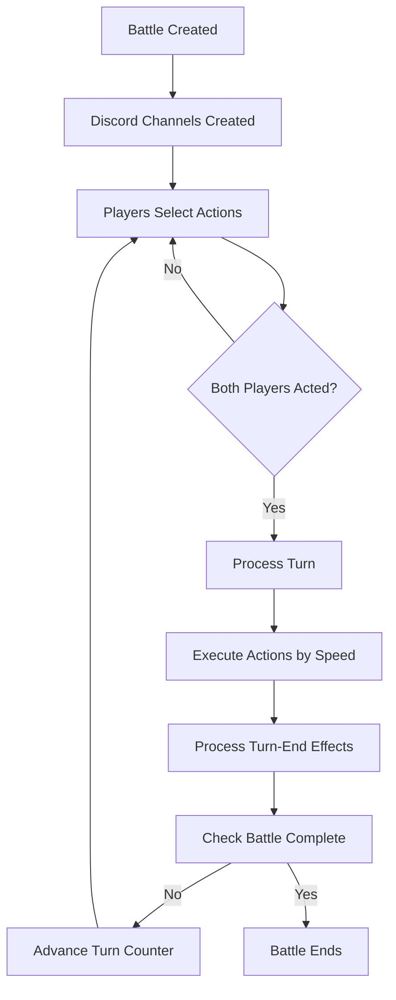

# Friemon Battle System Documentation

## Overview
The Friemon battle system is a turn-based combat system where two players battle with teams of 3 characters each. Players select moves simultaneously, and actions are executed based on speed/priority.

## Current Architecture

### Core Components

#### 1. **BattleManager** (`src/lib/battle/BattleManager.ts`)
- **Purpose**: Central orchestrator for all battles
- **Key Responsibilities**:
  - Creating and managing battle sessions
  - Validating player actions
  - Processing complete turns
  - Handling timeouts and forfeits

#### 2. **Battle** (`src/lib/battle/Battle.ts`)
- **Purpose**: Core battle logic and state management
- **Key Responsibilities**:
  - Executing techniques between characters
  - Managing character switching
  - Processing turn-end effects (conditions, hazards)
  - Determining battle completion

#### 3. **BattleInterface** (`src/lib/battle/BattleInterface.ts`)
- **Purpose**: Discord UI generation for battles
- **Key Responsibilities**:
  - Creating battle status embeds
  - Generating move selection menus
  - Formatting battle logs
  - Player-specific action displays

#### 4. **Event System** (`src/lib/battle/BattleEventEmitter.ts`)
- **Purpose**: Decoupled communication between battle components
- **Events**:
  - `battle:move-selected` - Player selects an action
  - `battle:turn-complete` - Turn processing finished
  - `battle:completed` - Battle ended
  - `battle:channels-created` - Discord channels set up

### Battle Flow



### Current Issues & Debugging

#### 1. **Turn Progression Problems**

**Symptoms**: Turns don't advance after both players act
**Potential Causes**:
- Event listeners not properly set up
- Turn processing method not being called
- Battle state validation failing

**Debug Steps**:
```typescript
// Check if events are firing
console.log('Move selected event fired for:', userId);

// Check if turn processing is called
console.log('Processing turn:', session.currentTurn);

// Check battle state
console.log('Battle state valid:', battle.validateBattleState());
```

#### 2. **Action Selection Issues**

**Symptoms**: Technique selections don't work or show as invalid
**Potential Causes**:
- Character technique objects not properly loaded
- Technique name mismatch between menu and validation
- Mana cost validation failing

**Debug Steps**:
```typescript
// Check character techniques
console.log('Character techniques:', character.techniques.map(t => t.name));

// Check selected technique
console.log('Selected technique:', selectedValue, 'Found:', character.getTechniqueByName(target));
```

### System Listeners

#### 1. **DiscordInteractionListener**
- Listens to Discord string select menu interactions
- Filters for `battle_move_select` custom ID
- Validates player is in correct channel
- Emits `battle:move-selected` event

#### 2. **BattleActionListener**
- Handles move selection events
- Calls `BattleManager.executePlayerAction()`
- Triggers turn processing when both players act
- Updates Discord interfaces

#### 3. **ChannelUpdateListener**
- Handles battle channel updates
- Sends initial move selection messages
- Updates channels after turn completion
- Sends battle completion messages

### Character & Technique System

#### Character Structure
```typescript
class Character {
  techniques: Technique[]  // Array of technique objects (not strings!)
  
  getTechniqueByName(name: string): Technique | null
  getTechniqueNames(): string[]
  learnTechnique(technique: Technique | string): boolean
}
```

#### Technique Assignment
- Characters get techniques via `TechniqueAssignment.ts`
- System uses predefined sets + racial progression
- Fallback to string-based assignment if needed

### Common Problems & Solutions

#### Problem: "No active battle found"
**Cause**: Battle session not properly stored or retrieved
**Solution**: Check `BattleManager.activeBattles` map

#### Problem: "Character does not know this technique"
**Cause**: Technique name mismatch or character has no techniques
**Solution**: Verify technique assignment in character creation

#### Problem: Events not firing
**Cause**: Event listeners not initialized
**Solution**: Ensure `BattleSystemManager.initialize()` is called

#### Problem: Turn counter stuck
**Cause**: Turn processing logic not completing
**Solution**: Check `processTurn()` method execution

### Testing the System

#### 1. **Create a Battle**
```typescript
const session = BattleManager.createPlayerBattle(player1Id, player2Id);
console.log('Battle created:', session.id);
```

#### 2. **Check Character Techniques**
```typescript
const char = session.battle.state.userCharacter;
console.log('Techniques:', char.getTechniqueNames());
```

#### 3. **Simulate Player Action**
```typescript
const result = await BattleManager.executePlayerAction(userId, 'attack', 'zoltraak');
console.log('Action result:', result);
```

#### 4. **Check Turn Processing**
```typescript
// Both players act
await BattleManager.executePlayerAction(player1Id, 'attack', 'zoltraak');
await BattleManager.executePlayerAction(player2Id, 'attack', 'ember');

// Check if turn advanced
console.log('Current turn:', session.currentTurn);
```

### File Structure
```
src/lib/battle/
├── BattleManager.ts           # Main battle orchestrator
├── Battle.ts                  # Core battle logic
├── BattleInterface.ts         # Discord UI generation
├── BattleEventEmitter.ts      # Event system
├── BattleSystemManager.ts     # System initialization
└── listeners/
    ├── DiscordInteractionListener.ts  # Discord events
    ├── BattleActionListener.ts        # Action processing
    └── ChannelUpdateListener.ts       # Channel updates

src/lib/data/
├── TechniqueAssignment.ts     # New technique system
├── Techniques.ts              # Technique definitions
└── Characters.ts              # Character data

src/lib/character/
├── Character.ts               # Character class (updated)
└── Technique.ts               # Technique class
```

### Initialization Chain

1. **Client starts** → `FriemonClient.login()`
2. **Battle system initializes** → `battleSystem.initialize(client)`
3. **Listeners set up** → All three listeners register
4. **Battle created** → `BattleManager.createPlayerBattle()`
5. **Channels created** → `BattleManager.createBattleThreads()`
6. **Event fired** → `battleEvents.emitChannelsCreated()`
7. **Initial messages sent** → `ChannelUpdateListener.handleChannelsCreated()`

### Key Questions for Debugging

1. **Is the battle system initialized?**
   - Check console for "Battle System Manager initialized successfully"

2. **Are Discord interactions being received?**
   - Check console for interaction events

3. **Are characters getting proper techniques?**
   - Check character.techniques array

4. **Are events firing?**
   - Add console.logs to event emissions

5. **Is turn processing being called?**
   - Check for "Processing turn X" console logs

### Next Steps for Fixing

1. **Add comprehensive logging** to track event flow
2. **Verify event listener registration** in `BattleSystemManager`
3. **Test character technique assignment** independently
4. **Check Discord interaction filtering** logic
5. **Validate battle state** at each step

---

## Quick Diagnostic Commands

```typescript
// Check if system is initialized
console.log('Battle system ready:', battleSystem.isReady());

// Check active battles
console.log('Active battles:', BattleManager.getActiveBattleStats());

// Validate all technique sets
const validation = validateTechniqueSets();
console.log('Technique validation:', validation);
```

This system should work, but the issue might be in the event listener setup or Discord interaction handling. The most likely culprit is that events aren't being properly emitted or received between components.